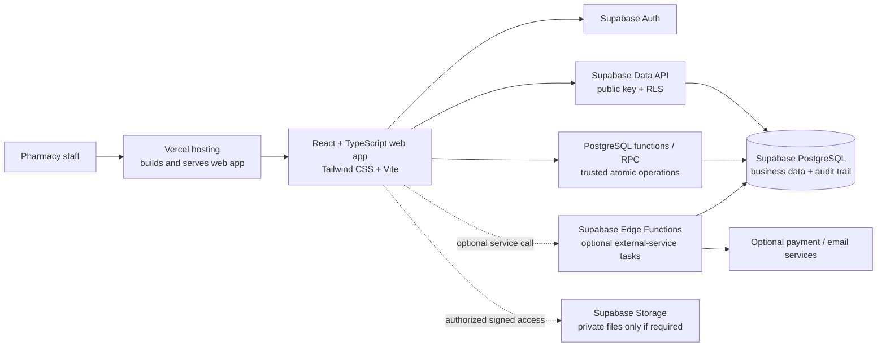

# Pharmacy Management System Architecture

**Status:** Proposed  
**Version:** 1.0  
**Date:** 2026-10-01  
**Related document:** [PRD](PRD.md)

## 1. Architecture Goals

- Use React, Tailwind CSS, and Vite for a responsive pharmacy operations interface.
- Use Supabase for PostgreSQL, authentication, authorization policies, and optional private file storage.
- Use Vercel to build and host the web application and its preview deployments.
- Keep stock, transaction, and permission rules enforced by trusted backend/database operations, not only by browser code.
- Keep the first release manageable for one pharmacy while making deliberate decisions about future branch or multi-pharmacy support.

This is a proposal, not an implementation specification. Confirm jurisdiction, privacy, data residency, and operational requirements before choosing production plans or enabling prescription-data workflows.

## 2. High-Level System

Vercel serves the frontend. Supabase is the system of record and enforces data access through PostgreSQL Row Level Security (RLS). The browser may use the Supabase public/anon key only when RLS is enabled and correctly tested. Sensitive transaction workflows are handled by database functions/RPCs so database changes can be validated and committed atomically.

## 3. Proposed Technology Choices

| Area | Proposal | Notes |
| --- | --- | --- |
| Frontend | React + TypeScript | Use TypeScript for application and shared data types. |
| Build and local development | Vite | Configure SPA route fallback for direct navigation to nested routes on Vercel. |
| Styling | Tailwind CSS | Use a consistent accessible component approach for forms, tables, dialogs, and POS workflows. |
| Routing | React Router | Client-side routes for catalog, inventory, purchases, customers, POS, reports, and administration. |
| Data fetching | TanStack Query (recommended) | Centralize query state, invalidation, loading, and error handling. |
| Forms and validation | React Hook Form + Zod (recommended) | Validate user input at the UI boundary; repeat authoritative business validation in the database. |
| Backend/database | Supabase PostgreSQL | Source of truth for business records, constraints, transactions, and RLS policies. |
| Authentication | Supabase Auth | User identity and session management; application roles stored and checked securely. |
| File storage | Supabase Storage, if needed | Private buckets only; use short-lived signed URLs and restrictive policies. Avoid prescription uploads in the MVP unless required. |
| Web hosting | Vercel | Host the Vite build and provide preview deployments. Do not connect previews to production data. |
| Tests | Vitest, React Testing Library, Playwright | Unit/component tests, database/RLS integration tests, and end-to-end workflows. |
| CI and source control | GitHub Actions or equivalent | Run build, lint, test, migration checks, and release validation. |

These are recommendations. Avoid introducing extra services until a confirmed requirement needs them.

## 4. Application Responsibilities

### Web application

The React application provides the user interface for:

- Sign-in and role-aware navigation.
- Medicine catalog and search.
- Inventory, batch, stock count, and expiry views.
- Suppliers, purchases, and receiving.
- Customers and prescription records where permitted.
- Point of sale, payment recording, returns, and invoices.
- Reports, exports, and administration.

The UI may hide actions a user cannot perform, but this is usability only; it is not the security boundary.

### Supabase/PostgreSQL

PostgreSQL owns the canonical data and enforces:

- Relationships, required fields, uniqueness, valid states, and other data constraints.
- RLS policies for access to pharmacy data based on the authenticated user and assigned role.
- Atomic stock-changing operations for sales, purchase receipts, returns, and adjustments.
- Immutable or append-only business records where history must be preserved.
- Audit events for important changes.

### Edge/server functions

Use PostgreSQL functions/RPCs for database-centered operations that must be atomic, such as completing a sale or confirming a receipt. Use Supabase Edge Functions only when an operation needs server-side orchestration, secrets, or calls to an external service. Vercel serverless functions are optional, not a second default backend; use them only when there is a clear deployment or integration reason.

Never expose Supabase service-role keys or other privileged secrets in the browser bundle. Store privileged secrets only in protected server-side configuration.

## 5. Data and Transaction Design

### Core entities

The initial schema is expected to include:

- Users, pharmacy memberships, and roles.
- Medicines and categories.
- Suppliers and customers.
- Purchases, purchase lines, receipts, and supplier payments.
- Inventory batches and stock movements.
- Sales, sale lines, payments, returns, and refunds.
- Prescriptions and dispense/review records, only as required by local rules.
- Pharmacy settings, invoice configuration, and audit events.

Finalize exact tables and relationships during database design. Decide early whether records need a `pharmacy_id` or `location_id` boundary for future multi-branch support; adding a field later does not automatically provide secure multi-tenancy.

### Inventory ledger and concurrency

- Every receipt, sale, return, disposal, or adjustment creates a traceable stock movement linked to its source transaction and actor.
- Track inventory by batch when expiry and lot traceability apply. Do not allow an expired batch to be selected for sale.
- A sale completion must re-check stock and batch eligibility inside a database transaction, then record the sale, payment state, stock movements, and audit event together.
- A receipt confirmation must record received batch details and increase stock in the same atomic operation.
- Use row locks or another safe concurrency strategy so simultaneous checkouts cannot oversell a batch. Browser-side checks alone are insufficient.
- Preserve completed transactions. Correct errors with reversal, void, return, or adjustment records instead of deleting history.
- Reconcile any cached on-hand balance against the movement ledger and define how discrepancies are investigated.

### Money and time

- Pick one explicit money representation and currency policy. Use fixed-precision decimal or integer minor units; never rely on binary floating-point for totals.
- Define rounding, tax calculation, discount order, invoice numbering, and timezone rules with the pharmacy's jurisdiction and accounting requirements.
- Store transaction timestamps consistently (typically UTC) and render them in the configured pharmacy timezone.

## 6. Security and Privacy

- Require authentication for operational data and apply least-privilege roles for administrator, pharmacist, cashier, inventory staff, and read-only users.
- Enable and test RLS for every exposed table and storage bucket. Test both allowed and denied direct API requests for every role.
- Keep role assignments in trusted database records or securely controlled claims. Do not grant permissions based on user-editable profile metadata.
- Scope data consistently to a pharmacy/location if those boundaries are part of the product. Review policies for reads, inserts, updates, deletes, and RPC execution.
- Minimize customer and prescription information. Define who can view it, how long it is retained, how correction/deletion requests are handled, and how exports are audited.
- Use private storage for any sensitive documents and avoid public URLs. Do not add document upload until legal retention, access, malware scanning, and deletion behavior are decided.
- Redact personal and prescription details from application logs, error monitoring, and analytics.
- If payment cards are accepted through an integration, use a payment provider and do not store card numbers or security codes in this system.
- Review Supabase and Vercel data processing terms, region availability, backup capabilities, and regulatory suitability for the pharmacy's location. Do not assume a vendor or plan automatically satisfies a specific healthcare regulation.

## 7. Environments and Deployment

Maintain separate Supabase projects and credentials for development, staging, and production.

1. Developers work against local or development data, never copied production prescription/customer data unless an approved protected process exists.
2. Pull requests create Vercel preview deployments connected only to non-production Supabase environments.
3. CI validates the frontend, tests, and versioned database migrations.
4. Reviewed migrations are applied to staging, then verified using acceptance and security tests.
5. Production release applies approved migrations and deploys the reviewed frontend with production-only secrets.
6. Keep a rollback/recovery plan for both frontend releases and database changes; database migrations should be designed to avoid unsafe destructive rollbacks.

Store schema and policy changes as version-controlled migrations. Avoid manual, untracked changes in production dashboards.

## 8. Reliability and Operations

Before production, define and validate:

- Backup schedule, retention, recovery point objective (RPO), and recovery time objective (RTO).
- Restore exercises and ownership of recovery operations.
- Monitoring for application errors, failed database operations, capacity limits, and background-task failures.
- Alert routing and incident response responsibilities.
- Availability expectations and a workflow for temporary network/provider outages; do not assume offline sales are supported unless designed and reconciled explicitly.
- Vendor plan limits, database connection behavior, storage limits, and expected transaction volume.
- Data export and pharmacy offboarding process to avoid unnecessary vendor lock-in.

## 9. Quality Strategy

- **Unit/component tests:** Validate calculation and UI behavior, including discounts, tax display, form validation, and error states.
- **Database integration tests:** Verify constraints, RPC behavior, transaction rollback, batch selection, concurrent checkout behavior, and RLS for every role.
- **End-to-end tests:** Cover receiving a purchase, completing a sale, rejecting expired/insufficient stock, issuing a return, generating an invoice, and reviewing reports.
- **Security checks:** Test direct API access and storage access, not only front-end screens. Confirm privileged keys are absent from built assets.
- **Operational checks:** Exercise migration and backup restoration processes before relying on them.

## 10. Decisions to Resolve Before Implementation

1. Which country/region, privacy laws, pharmacy regulations, prescription rules, tax requirements, and invoice retention rules apply?
2. Is the initial system for one location, with a future branch model, or multiple branches from day one?
3. Must prescriptions or supporting documents be stored, or is a minimal prescription reference sufficient?
4. What payment methods, terminals, refunds, and credit-sale rules are required?
5. What are the expected users, concurrency, catalog size, daily transaction volume, availability target, RPO, and RTO?
6. Which barcode scanners, receipt printers, browsers, and devices must be supported?
7. What are the stock-count, batch/lot, expiry, disposal, and stock-override policies?
8. Who owns production deployment, database migrations, security reviews, backups, monitoring, and incident response?
9. Which Supabase and Vercel regions/plans meet the pharmacy's contractual, data-residency, and operational requirements?
10. Are email, SMS, payment, accounting, or wholesaler integrations needed for the first release, or should they remain future extensions?
