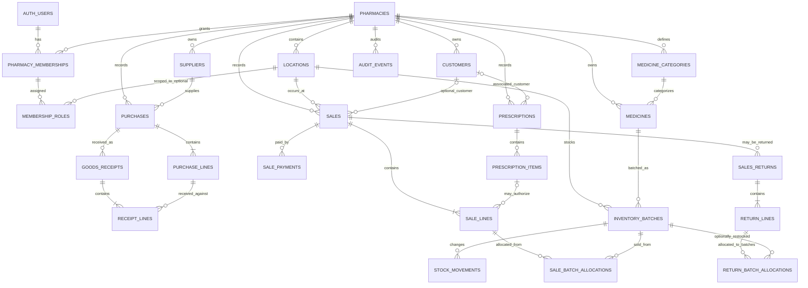

# Pharmacy Management System Database Design

**Status:** Proposed draft  
**Version:** 0.1  
**Date:** 2026-10-01  
**Related documents:** [PRD](PRD.md) · [Architecture](architecture.md)

> This document describes a proposed logical schema for review. It is not SQL, a Supabase migration, or an implemented database. Prescription, tax, retention, and controlled-medicine fields must be checked against the pharmacy's jurisdiction before implementation.

## 1. Design Goals

- Use Supabase PostgreSQL as the authoritative source for pharmacy data.
- Model pharmacy membership and data ownership explicitly so RLS can enforce access.
- Preserve sales, purchases, payments, stock movements, and audit history rather than silently deleting completed records.
- Track inventory by batch and expiry, and prevent concurrent sales from overselling stock.
- Keep customer and prescription information minimal and access-controlled.
- Make money, tax, time, status, and quantity rules explicit and testable.

## 2. Proposed Entity Relationship Diagram

The diagram is conceptual. Exact nullability, delete behavior, and whether a relationship is required depend on the final pharmacy workflows.

## 3. Common Data Conventions

- **Primary keys:** UUIDs generated by PostgreSQL. Do not expose sequential database IDs as invoice or prescription references.
- **Tenant boundary:** Add `pharmacy_id` to every pharmacy-owned record and include it in relevant foreign keys and RLS checks. Include `location_id` on stock, receipts, sales, and other location-specific records if branches are in scope. Even for a single-location MVP, decide this boundary before migrations.
- **Timestamps:** Store event timestamps as `timestamptz` in UTC; render them using the pharmacy's configured timezone. Expiry is a calendar date (`date`), not a timestamp.
- **Money:** Prefer integer minor units (for example, cents) with an explicit ISO currency code on each financial document. Confirm currency exponent and rounding rules for the launch jurisdiction. Never calculate totals using browser floating-point values as the authority.
- **Quantities:** Use `numeric` with a documented precision if fractional quantities are allowed; otherwise use an integer type for countable units. Define a consistent unit-of-measure policy.
- **Status fields:** Use constrained values (PostgreSQL enums or check constraints) and explicit allowed transitions. Do not treat arbitrary status strings as workflow logic.
- **History:** Use `created_at`, `created_by`, and, for mutable master data, `updated_at`, `updated_by`, and an `is_active`/archival state. Completed financial and stock records are reversed, not hard-deleted.
- **Sensitive data:** Avoid broad JSON blobs for core business fields. Keep prescription and personal data minimal and out of logs. Apply retention and export controls before enabling sensitive fields.

## 4. Proposed Tables

### 4.1 Pharmacy, locations, and access

| Table | Purpose and key fields |
| --- | --- |
| `pharmacies` | Tenant root; name, contact details, currency, timezone, tax/invoice configuration, created timestamp. |
| `locations` | Optional branch/store location; `pharmacy_id`, name, address, active status. Use one default location for an initial single-store deployment if location tracking is adopted. |
| `pharmacy_memberships` | Joins an `auth.users.id` to a pharmacy; `pharmacy_id`, `user_id`, active status, invited/created timestamps. Unique pharmacy/user pair. |
| `membership_roles` | Roles assigned to a membership; role such as administrator, pharmacist, cashier, inventory, or read-only; optional location scope. Prevent users from editing their own privilege assignments. |

Supabase Auth owns credentials and identity lifecycle. Do not duplicate passwords or trust user-editable profile metadata for authorization. If an application profile table is needed, reference `auth.users` and store only non-secret profile details.

### 4.2 Catalog and counterparties

| Table | Purpose and key fields |
| --- | --- |
| `medicine_categories` | Pharmacy-scoped category label, optional description, active status. |
| `medicines` | Pharmacy-scoped catalog item; internal code, name, generic name, strength, dosage form, unit of measure, optional barcode/SKU, category, tax classification, reorder threshold, active status. |
| `suppliers` | Pharmacy-scoped supplier name, contact/address details, optional business/tax identifier, notes, active status. |
| `customers` | Pharmacy-scoped minimal customer details; name and optional contact details/notes, active status. Avoid collecting data not required for the workflow. |

Medicine purchase cost and sale price should be captured as transaction snapshots on purchase and sale lines. If current default prices are maintained on `medicines`, price changes must be audited; historical invoices must never recalculate from the current catalog price.

### 4.3 Purchasing and receiving

| Table | Purpose and key fields |
| --- | --- |
| `purchases` | Supplier, pharmacy/location, supplier reference, purchase date, state, currency, subtotal, discount, tax, total, notes, creator and timestamps. Draft/ordered/partially received/received/closed or cancelled states need confirmed transition rules. |
| `purchase_lines` | Purchase, medicine, ordered quantity, unit cost snapshot, discount/tax inputs and totals, received quantity or a value derived from receipt lines. Do not allow received quantity to exceed ordered quantity unless an explicit exception is approved. |
| `goods_receipts` | Receipt against a purchase, reference, receiving location, received timestamp, state, and confirming user. |
| `receipt_lines` | Receipt, purchase line, medicine, received quantity, unit cost snapshot, batch/lot number, and expiry date where applicable. Receipt confirmation creates or updates a corresponding inventory batch and stock movement atomically. |
| `supplier_payments` | Supplier, optional purchase allocation, amount, currency, method/reference, paid timestamp, and recorded user. Supports partial payments; do not infer payment solely from purchase status. |

Clarify whether purchases without a formal purchase order are allowed. If so, make `purchase_id` optional on a goods receipt or support a direct receipt workflow with the same validation and audit requirements.

### 4.4 Inventory

| Table | Purpose and key fields |
| --- | --- |
| `inventory_batches` | Pharmacy/location, medicine, optional supplier and receipt source, batch/lot number, expiry date, unit cost, and current on-hand quantity. Use a stable ID even if batch number is absent or duplicated across suppliers. |
| `stock_movements` | Append-only record for each stock increase/decrease; pharmacy/location, batch, signed quantity delta, movement type, source transaction/line, actor, timestamp, and reason where applicable. |
| `stock_adjustments` | Adjustment header with location, reason, state, creator, approver if required, and timestamps. Adjustment lines identify batch and counted/delta quantity; confirmation creates movements. |

The `inventory_batches` quantity is a lockable current balance for efficient availability checks; the movement ledger is the traceable history. Every update to the balance must happen in the same database transaction as its stock movement. Add a reconciliation check/report to detect mismatches. A movement must have a valid source and should not be editable or deletable by normal application roles.

### 4.5 Sales, payments, and returns

| Table | Purpose and key fields |
| --- | --- |
| `sales` | Pharmacy/location, unique invoice number, optional customer and prescription, sale state, currency, subtotal, discount, tax, total, cashier, completion time, and idempotency key. |
| `sale_lines` | Sale, medicine, sold quantity, unit price snapshot, discount/tax snapshots, line totals, and optional prescription item reference. Preserve product description/strength snapshots needed to reproduce the invoice. |
| `sale_batch_allocations` | Allocation of a sale line's quantity across one or more eligible inventory batches; batch and quantity. Supports FEFO while preserving exact lot traceability. |
| `sale_payments` | Sale, amount, method, currency, provider/reference, status, recorded timestamp, and actor. Supports multiple/partial payments if required. Do not store payment card data. |
| `sales_returns` | Original sale, return reference, reason, state, refund total, actor, and timestamps. |
| `return_lines` | Original sale line, returned quantity, refund/tax snapshots, reason, and whether the item is eligible for restock. |
| `return_batch_allocations` | Maps a returned quantity to the original batch allocation; records whether it was restocked. Restocking creates a positive movement; non-restocked returns do not increase sellable stock. |

A completed invoice is immutable. Voids and refunds create explicit linked records and stock/payment effects rather than editing the original sale. Configure unique invoice numbering per pharmacy (and location if required) and allocate numbers safely in the database transaction.

### 4.6 Prescriptions and auditing

| Table | Purpose and key fields |
| --- | --- |
| `prescriptions` | Pharmacy, optional customer, minimal locally required reference/prescriber/issue date/status/review metadata, and created/reviewed actor/timestamps. Define retention and restricted access before use. |
| `prescription_items` | Prescription, prescribed medicine description or medicine reference, quantity, optional refill/repeat data, and locally required status. Exact schema is jurisdiction-dependent. |
| `audit_events` | Pharmacy, actor, action, entity type and ID, timestamp, request/correlation ID, reason, and carefully redacted before/after values where justified. Restrict update/delete. |

If prescription documents are required, keep file bytes in a private storage bucket and metadata in a separate table with storage key, owner, classification, upload actor/time, and retention state. Do not make the bucket public or store signed URLs as permanent data.

## 5. Important Constraints and Indexes

Implement these as database constraints, indexes, policies, or trusted transaction logic as appropriate:

- Unique membership per `(pharmacy_id, user_id)` and unique medicine internal code per pharmacy.
- Unique invoice number per pharmacy (or pharmacy/location) and unique supplier reference where the pharmacy requires it.
- Foreign keys must not allow a row to reference a medicine, customer, supplier, batch, or transaction from another pharmacy. Use composite tenant-aware foreign keys where practical.
- Quantities must be positive on purchase, receipt, sale, and return lines; stock movements may be positive or negative but cannot be zero.
- Purchase received totals cannot exceed ordered totals unless an authorized exception is recorded.
- Return quantities cannot exceed the unreturned quantity of the original sale line.
- A sale allocation must reference a batch for the same medicine and pharmacy/location. A completed sale cannot allocate expired or insufficient stock.
- Expiry eligibility and stock availability must be rechecked at transaction commit time, not only when the UI initially loads inventory.
- Add indexes for common lookup and report paths: pharmacy and active status, medicine name/code/barcode, supplier/customer name, batch medicine/expiry, stock movement batch/time, sale invoice/date/customer, purchase supplier/date, and foreign keys used by RLS.
- Use partial indexes for active catalog records or nullable barcodes when beneficial. Consider trigram/full-text search only after validating actual search needs and query plans.
- Add idempotency protection to checkout, receipt confirmation, and payment callbacks so network retries cannot duplicate transactions.

## 6. Transaction Boundaries

### Complete sale

A trusted PostgreSQL function/RPC should, in one transaction:

1. Verify the caller's membership, role, pharmacy, and location permissions.
2. Validate sale state, prices/tax inputs, required customer/prescription references, and an idempotency key.
3. Lock or safely serialize eligible batch balances; re-check active medicine, expiry, and available quantities.
4. Create the sale and immutable line snapshots, allocate quantities to batches, and record stock movements.
5. Update the lockable batch balances, record payment state, allocate the invoice number, and write audit events.
6. Commit all changes together, or roll back all changes on any failure.

### Confirm receipt

A trusted database operation validates the purchase and receipt state, quantities, location, batch, and expiry values, then inserts/updates batches, movements, purchase received totals, and audit events atomically.

### Return or adjustment

Validate the original sale/receipt and remaining quantities, record the reason and actor, update stock only where items are eligible for restocking, record payment/refund effects, and preserve the original transaction history.

These operations must not be implemented as a sequence of independent browser writes.

## 7. Authorization and RLS Plan

- Enable RLS on every table reachable through Supabase's client-facing API, and on storage buckets containing private files.
- Base access on `auth.uid()` joined to active `pharmacy_memberships` and trusted `membership_roles`; do not trust a pharmacy ID, role, or user ID supplied by the client without checking membership.
- Read policies should enforce pharmacy scope and role-specific visibility. Prescription and customer access may need narrower policies than general catalog access.
- Insert/update policies should enforce pharmacy ownership, allowed columns/state transitions, and actor identity. For sensitive state changes, prefer a narrow RPC instead of broad table writes.
- Deny ordinary client roles permission to update/delete completed sales, stock movements, or audit events. Use reversal workflows.
- Restrict execution of security-definer functions; set a safe `search_path`, validate `auth.uid()` and tenant scope inside the function, and grant execute only to intended roles.
- Keep the Supabase service-role key server-side only. It bypasses RLS and must not be used as a shortcut for ordinary application operations.
- Test each policy with positive and negative cases for every role, including direct REST/RPC calls and cross-pharmacy access attempts.

## 8. Reporting and Data Lifecycle

- Reports should query authoritative transaction and movement records or validated views; document how returns, discounts, taxes, and partial payments affect totals.
- If performance later requires cached balances or summary tables, define refresh/reconciliation behavior and keep the ledger authoritative.
- Define retention and archival policy for customers, prescriptions, invoices, audit events, and backups with the pharmacy's legal adviser.
- Deactivation is preferred to deletion for medicines, suppliers, and customers referenced by history. Any legal erasure workflow must preserve legally required transaction evidence while minimizing or anonymizing personal data as permitted.
- Export permissions, access logging, and data deletion/anonymization processes must be designed before production use.

## 9. Migration and Validation Plan

- Implement schema changes only through reviewed, version-controlled Supabase/PostgreSQL migrations.
- Build the schema in layers: tenant/access foundation; catalog/counterparties; purchasing/receipts/inventory; sales/payments/returns; prescriptions/audit; then reporting indexes and views.
- Seed only non-sensitive development data. Do not copy production customer or prescription records into previews or local environments without an approved protected process.
- Before production, test constraints, tenant isolation, RLS policies, RPC rollback behavior, duplicate request handling, stock concurrency, expiry rejection, invoice uniqueness, and restore procedures.
- Validate all table and RPC grants from an untrusted client role; RLS without correct grants, or grants without RLS, can produce unintended access.

## 10. Decisions Needed Before Final Schema

1. Which jurisdiction, prescription/controlled-medicine requirements, privacy rules, tax calculation, currency, invoice numbering, and retention periods apply?
2. One pharmacy location or multiple branches in the first release? Must all records carry both `pharmacy_id` and `location_id`?
3. Are medicine prices and tax rates pharmacy-specific, and is a history of catalog price changes required?
4. Are fractional quantities needed for any products? Which units and decimal precision are valid?
5. Are purchase orders mandatory, or can staff receive stock directly? How are partial receipts, supplier returns, and over-receipts handled?
6. Which payment methods, partial/credit payments, payment gateway callbacks, and refund rules are required?
7. Must prescriptions be stored as structured data, document attachments, or only a reference? Which roles can access them?
8. What batch-number and expiry rules apply to products without supplied lot or expiry data?
9. How should a returned medicine be evaluated for restocking, quarantine, or disposal?
10. What expected volumes and reporting latency should guide indexes, balance caching, and archival strategy?
